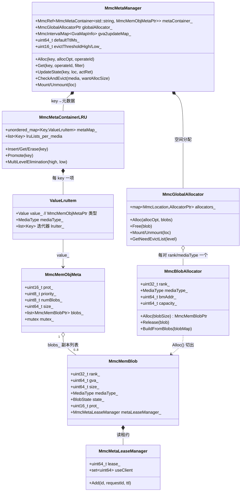

# Ascend MemCache — 架构与数据面

> 源码：`3rdparty/memcache` @ `14b4e35`。总览 [overview.md](overview.md)。  
> 对照：Mooncake store [`../mooncake/kv-store.md`](../mooncake/kv-store.md)；LMCache [`../lmcache/sharing-and-backends.md`](../lmcache/sharing-and-backends.md)。

## MetaService

职责（README + `mmc_meta_service.cpp`）：

- 集群**内存池空间**分配与回收；
- **LocalService** 加入 / 退出；
- **对象元数据**（key → 副本位置、介质类型、GVA 等）；
- 触发 / 协调**多层淘汰**（与 `MmcMetaContainerLRU` / `MultiLevelElimination` 配合）。

部署：

| 模式 | 说明 |
|------|------|
| 单点 | 单 Meta 进程；简单；进程挂则服务停 |
| HA | K8s ClusterIP + Lease 多活；元数据恢复；文档称**尽力而为**（`doc/memcache_metaservice_HA.md`） |

启动：Python API 或二进制（`doc/install_whl.md` / `install_run.md`）。

## LocalService

双重角色：

1. **客户端**：whl/so 链进推理进程，调 `ObjectStore` / `mmcc_*`；
2. **内存提供者**：贡献连续 HBM/DRAM（及配置下的 SSD 路径），他节点可经 MemFabric **按地址**访问。

`MmcBmProxy`（`mmc_bm_proxy.cpp`）按 `MEDIA_HBM` / `MEDIA_DRAM` 取 MemFabric BM 指针与本地容量，并选择 H2G/G2H/L2G 等 copy 类型——即「本地介质 ↔ 全局可见地址」的粘合层。

扩缩：支持 LocalService 动态加入/移除（README）；配置含 `world_size`、protocol、每卡 dram/hbm size（`mmc_config_const.h` / `doc/memcache_config.md`）。

## 对象 API 形态

`ObjectStore`（`include/cpp/mmcache.h`）：

- 生命周期：`CreateObjectStore` → `Setup` → `Init(deviceId, initBm)` → `TearDown`；
- 零拷贝：`RegisterBuffer` / `UnRegisterBuffer`；
- 读写：`GetInto` / 批量变体；put 侧配合 `ReplicateConfig`（`replicaNum`≤8、可选 preferred LocalService）；
- 对象可含**多个 blob**（`blobNum_`、每 blob 的 `loc_` / `type_` / `gva_`）——适配「一层一地址」的离散 KV 布局（README 性能节 DeepSeek-R1 块：多段离散地址）。

C API：`mmc_client.h`::`mmcc_put` / `mmcc_batch_put` 等。  
Python：`pymmc.cpp` + `doc/memcache_python_api.md`。  
管理：`doc/memcache_restful_api.md`。

**与 lake**：形近「dumb 字节 put/get」；lake 在控制面另建 radix / `RegisterBlocks`，池不解释张量布局。

## MetaService 元数据层次：

MetaService 内存中的元数据是一条**四层持有链**（`MmcMetaManager` → 容器/分配器 `MmcMetaContainerLRU` → 对象 → blob），key 本身不进对象元数据，而是容器的索引：

各层要点（源码：`csrc/meta_service/mmc_meta_container_lru.cpp`、`csrc/entities/mmc_mem_obj_meta.h`、`csrc/entities/mmc_mem_blob.h`）：

1. **key 在容器层**：`metaMap_` 维护 `key → ValueLruItem`，LRU 链 `lruLists_[]` 按介质（HBM/DRAM/SSD）分链、节点只存 key；`MmcMemObjMeta` 为 64B 精简设计，**没有 key 字段**。`Get` 命中后调 `Promote` 上提 LRU。
2. **`MmcMemObjMeta` = 对象属性 + 副本指针列表**：`prot_`（访问权限）、`priority_`（淘汰优先级）、`numBlobs_`（副本数）、`size_`（每份大小）+ 对象级 `mutex_`。列表内所有 blob 的 size 都等于对象大小——**1 个对象 = numBlobs_ 份完整副本，不是分片**（client 侧 `blobSize_ = TotalSize()`、`numBlobs_ = replicaNum`，上限 `MAX_BLOB_COPIES = 8`，`csrc/client/mmc_client_default.cpp`）。
3. **`blobs_` 存共享指针而非拷贝**：`MmcMemBlob` 是引用计数对象，实体由 `MmcBlobAllocator` 在该节点注册的内存段（`bmAddr_`/`capacity_`，区间树管理）上 `Alloc(blobSize)` 切出连续 GVA 区间得到；生命周期由 ObjMeta 维护（源码注释），Remove/Unmount 时归还 allocator 并从 `gva2updateMap_` 摘除。
4. **`MmcMemBlob` 四元组 `{rank, gva, size, mediaType}` 定位一份副本**：`gva_` 是他节点可直访的全局虚拟地址，数据面（BmProxy 按 gva 读写）完全绕过 MetaService；SSD/ubsIo 场景退化为纯元数据记录（`rank=UINT32_MAX, gva=0`）。
5. **blob 自带状态机与租约**：`ALLOCATED → READABLE → REMOVING → NONE`（`csrc/entities/mmc_blob_state.h`），client 分副本上报 `WRITE_OK/FAIL`，写成功才转 READABLE；`MmcMetaLeaseManager` 记录读持有者（clientId = `rankId<<32 | requestId`），Get 加租约、读毕释放，淘汰时据此避让在读副本。
6. **Manager 层旁路记录**：`gva2updateMap_`（区间图）跟踪 GVA_MALLOC 的分段写进度（区间填满才置 READABLE，`WRITE_FAIL` 整 key 删除）；服务层还有 `rankMediaTypeMap_`（rank→已注册介质，驱动扩缩容清理）与 `MMCMetaBackUpMgr` 的备份日志 `{op, key, blobDesc}`（HA 恢复用，见 [overview.md](overview.md)）。

Alloc/Get 的返回值即该层次的投影：`AllocResponse/GetResponse` 携带 `numBlobs_` + `vector<MmcMemBlobDesc>`（四元组拷贝），client 据此直接访问数据。

## 分层与淘汰

- 介质：HBM、DRAM；SSD 见 `doc/memcache_ssd_usage.md`（本地持久层用法）。
- 元数据容器：`mmc_meta_container_lru.cpp` 实现 LRU，并暴露 `MultiLevelElimination(high, low, …)`——高低水位驱动跨层淘汰/交换（与 README「多层缓存池、淘汰和预取」一致）。
- **对照 lake**：我们冷热 = 引用冻结 + LFU-Aging + 前缀亲和；L2=F4 恢复点、L3=SSOT；MemCache 未见公开 radix/前缀保护一等模型。

## 传输（MemFabric）

本仓调研**不展开**传输实现细节（以 MemCache API/元数据为准）。嵌套 `memfabric_hybrid` 在 recursive init 下会检出；非 recursive 时需另行确认已 init。产品文档声称路径包括：

| 协议（配置名） | 场景（文档） |
|----------------|--------------|
| `device_rdma` | A2/A3，设备 RoCE |
| `device_sdma` | A3 HCCS |
| `host_rdma` | A2/A3 主机 RDMA |
| `device_urma` / `device_uboe` | A5（文档路线） |
| `host_urma` | 鲲鹏 K5 |
| `host_shm` | 同节点共享内存 |

能力口号：**RH2D / D2RH** OneCopy（远端主机/设备内存 ↔ 本地设备），相对「先落本机再拷」减跳数。

**对照 lake**：NVIDIA 集群数据面优先 Mooncake TE；MemCache 证明「元数据服务 + 贡献内存节点 + 异构直传」在 Ascend 上可量产。若未来多芯片，Transfer Bus 可抽象多 backend，MemFabric 为候选之一而非唯一。

## 与 vLLM-Ascend 的边界

- README 指向 vllm-ascend `kv_pool` 文档：backend 枚举含 `mooncake` / `memcache` / `yuanrong`。  
- **本 submodule 无** `KVConnector` / AscendStoreConnector 源码；集成与配置键（`ock.mmc.meta_service_url` 等）在 vllm-ascend。  
- lake 若对照「引擎侧 KV pool worker」，应同时打开 vllm-ascend 文档，而不是只读本仓。

## 代码索引（架构向）

| 概念 | 文件:符号 |
|------|-----------|
| ObjectStore | `include/cpp/mmcache.h`::`ObjectStore` |
| Meta 服务 | `csrc/meta_service/mmc_meta_service.cpp` |
| Meta Get | `csrc/meta_service/mmc_meta_mgr_proxy.cpp`::`MmcMetaMgrProxy::Get` |
| 多层淘汰 | `csrc/meta_service/mmc_meta_container_lru.cpp`::`MultiLevelElimination` |
| 元数据管理 | `csrc/meta_service/mmc_meta_manager.h`::`MmcMetaManager` |
| 对象元数据 | `csrc/entities/mmc_mem_obj_meta.h`::`MmcMemObjMeta` |
| Blob/状态机 | `csrc/entities/mmc_mem_blob.h` / `mmc_blob_state.h`::`MmcMemBlob` |
| 读租约 | `csrc/entities/mmc_meta_lease_manager.h`::`MmcMetaLeaseManager` |
| 全局/段分配器 | `csrc/meta_service/mmc_global_allocator.h`::`MmcGlobalAllocator` / `mmc_blob_allocator.h`::`MmcBlobAllocator` |
| BM/介质 | `csrc/local_service/mmc_bm_proxy.cpp`::`MmcBmProxy` |
| Local 默认 | `csrc/local_service/mmc_local_service_default.cpp` |
| 配置键 | `csrc/config/mmc_config_const.h` |

→ [pain-points.md](pain-points.md)
